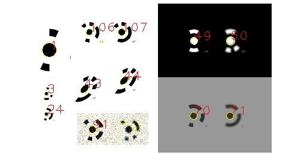

# Marker Detection

C++ project for the detection of round markers in images.



## Limitations
 - Partly occluded markers can get the wrong ID.
 - No standard deviation is returned.
 - Image noise has a large impact on sub-pixel measurement.

## Image Coordinate System
The origin of the image coordinate system (0,0) is located in the **CENTER** of the top-left pixel.

|   | Definition |
|---|---|
|OpenCV		| Center of the top-left pixel is (0,0); may be different for some parts of the library. |
|Metashape  | Center of the top-left pixel is (0.5,0.5); unable to find source, tested using Aicon marker detection. |
|Matlab		| Center of the top-left pixel is (1,1); https://www.mathworks.com/help/images/image-coordinate-systems.html |

## Use
### Install
- Install dependenciy OpenCV
	- For Windows use VCPKG: `vcpkg install opencv`
- Use IDE (Visual Studio Code, VisualStudio) to open CMakeList.txt and configure project.
- Build

### Use of executable
The executable is a simple example on how to use the code. It will detect markers in all images of one directory and save coordinates to textile.
```
./marker_detection <directory path> [0/1 (view detected markers)]
```

## Options
| Option (default) | Description |
|---|---|
| marker_min_diameter (4)		| Minimum diameter of marker in pixels. |
| marker_max_diameter (300)		| Maximum diameter of marker in pixels. |
| marker_min_contrast (20)		| Minimum contrast between marker and surrounding area. |
| max_ellipse_ratio (2)			| Maximum ratio between a and b (ratio = a/b). |
| canny_threshold1 (40)			| Canny threshold 1. |
| canny_threshold2 (100)		| Canny threshold 2. |
| return_uncoded_marker (true)	| If true, markers without code will be returned (with marker ID = -1). |
| detect_coded_marker (true)	| If true, the script will search for coded markers. |
| median_blur_kernel (5)		| Kernel size of the median blur filter (disable with -1). |
| blur_kernel (-1)				| Kernel size of blur filter (averaging, disable with -1). |
| sub_pixel_method (1)			| Method for sub-pixel measurement (see [Sub-pixel methods](#subpixelmethod)). |
| sub_pixel_scan_lines (50)		| Number of scan lines around ellipse when using star-operator. |
| sub_pixel_iterations (2)		| Number of iterations when using star-operator or Zhou-operator. |
| threshold_method (-1)			| Method for thresholding image to avoid missing markers in dark or bright areas (see [Image threshold methods](#imagethreshold)). |
| sigma_1 (5) / sigma_2 (25)	| Options for normalize_method == 2. Large values will increase processing time. |
| robust_ellipse_fit (true)		| Robust ellipse fit, will result in longer processing (see: https://doi.org/10.1016/j.isprsjprs.2021.04.010). |
| marker_contrast_consistency (0.6) | Consistency of contrast at the edge of the marker. 0 = inconsistent contrast around marker, 1 = same contrast at edge of marker. . |
| min_distance_closest_point (1.0) | Threshold for returning points in close proximity. Parameter is multiplied with a for uncoded markers and with 3*a for coded markers. Set to <0 for returning all points. |

<a name="subpixelmethod"></a>
### Sub-pixel Methods
- **0** - No sub-pixel measurement, default. Method: Canny - edge pixel will be used in `cv::fitEllipse()`, accuracy of < 0.3 pixels can be expected.
- **1** - Star-operator, *NOT TESTED*. Method: From the initial ellipse (Method 0) sub-pixel values along multiple scan lines (see parameter: sub_pixel_scan_lines) are extracted. Accurate edge position is extracted using moment preservation [(Tabatabai and Mitchell 1984)](https://ieeexplore.ieee.org/document/4767502). Function `cv::fitEllipse()` is used for ellipse fitting. Position is refined in multiple iterations (sub_pixel_iterations).
- **2** - Zhou-operator (no weights), *NOT TESTED*. Method: For each edge pixel, surrounding pixels in x and y directions are extracted and moment preservation is performed for more accurate positions. For each direction, line fit (`cv::fitline()`) is performed and the new position is given by the intersection of lines. Position is refined in multiple iterations (sub_pixel_iterations). Only working for larger markers.

<a name="imagethreshold"></a>
### Image Threshold Methods
- **-1** - No threshold, direct Canny edge detection.
- **0** - OpenCV `cv::threshold()` with `cv::THRESH_OTSU`.
- **1** - Adaptive Thresholding Method. D. Bradley and G. Roth, “Adaptive Thresholding using the Integral Image,” Journal of Graphics Tools, vol. 12, Art. no. 2, Jan. 2007, doi: [10.1080/2151237x.2007.10129236](https://www.tandfonline.com/doi/abs/10.1080/2151237X.2007.10129236).
- **2** - CLAHE histogram equalization. Use `clahe_clip_limit` to change result.
- **3** - Use `sigma_1` and `sigma_2` for adjustment. Option will increase processing time. See: https://de.mathworks.com/matlabcentral/fileexchange/8303-local-normalization

<a name="edgemethodes"></a>
### Edge Methods
- **0** - Edges are extracted using Canny edge detection.
- **1** - Using `cv::adaptiveThreshold()` and thinning of the edge afterwards. Relatively slow.

## Further Information
- Python marker generation: https://github.com/natowi/14-Bit-Circular-Coded-Target (not tested)
- Python marker decoding: https://github.com/poxiao2/CCTDecode (not tested)
- General Information: https://mpetroff.net/2018/05/photogrammetry-targets/
- Patent: https://patents.google.com/patent/DE19733466A1/en?oq=+DE19733466A1
- Matlab Code: https://de.mathworks.com/matlabcentral/fileexchange/156647-coded-photogrammetric-targets/?s_tid=mlc_lp_leaf
